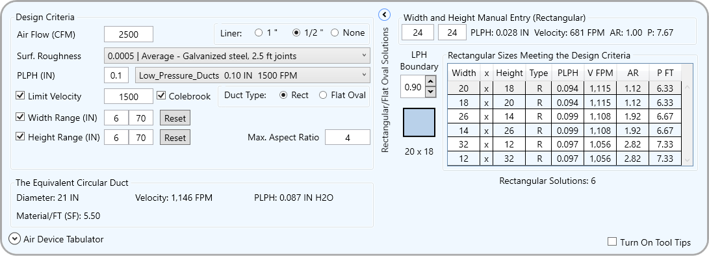
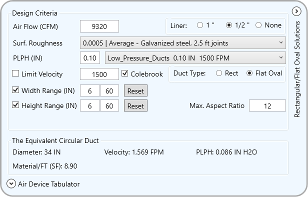
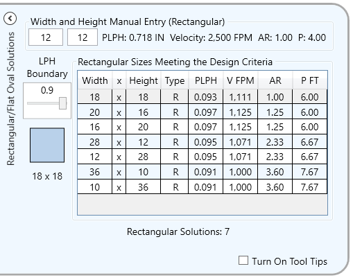
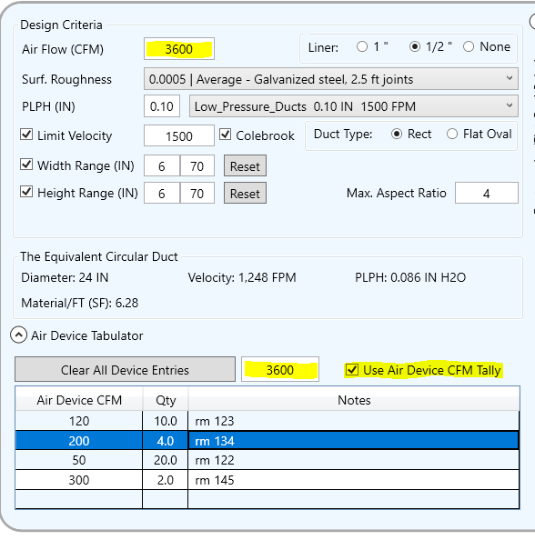

#  WpfaksDuctOMatic&nbsp;&nbsp;&nbsp;&nbsp;&nbsp;

-----
#  HVAC Air Duct Size Design Tool

-  DuctOMatic is a comprehensive, faster and more convenient HVAC duct size design tool than a manual Ductulator.

**Download:** **[WpfaksDuctOMatic.exe](https://github.com/akseidel/WpfaksDuctOMatic/blob/master/BuiltAlready/WpfaksDuctOMatic.exe)**

##  How To Use

-  Run the program. (This is a windows application.)
-  Enter the air flow CFM.
-  Select the duct liner choice. Duct sizes are the outside sheet metal sizes. The duct's air stream area is reduced by the duct liner. Be sure to select an appropriate surface roughness.
-  Select the surface roughness. The manual Ductulator does not account for surface roughness.
-  Select or enter the design PLPH factor (pressure loss inches per hundred feet of duct). Selecting the duct pressure class with the pulldown resets the PLPH value.
-  Enter and indicate any velocity limit the design needs.
-  Select the duct shape type rectangular or flat oval.
-  Read the circular solution at the bottom and the rectangular or flat oval solutions in the table at the right.

###  Air Device Tabulator
-  The expander at the bottom reveals a simple Air Device Tabulator.
-  Enter the the device values and notes as needed. The CFM will be summed.
-  The total value mirrors to the design CFM when the 'Use Air Device CFM Tally' checkbox is checked.

###  Documentation
-  The most important controls and features have popup tool tips to explain their operation or purpose.
-  Activate the 'Turn On Tool Tips' check box.
-  Hover over text and wait for the tool tip.

### Window Moving and Closing
-  Drag the window around to move it.
-  Close the application by Pressing ESC key whenever the application has focus.

###  Installation
-  Download the executable **[WpfaksDuctOMatic.exe](https://github.com/akseidel/WpfaksDuctOMatic/blob/master/BuiltAlready/WpfaksDuctOMatic.exe)** and run it.
-  The application first starts with default values, including its window position.
-  The next time it runs it will reuse many values that were set when the application was last closed.
